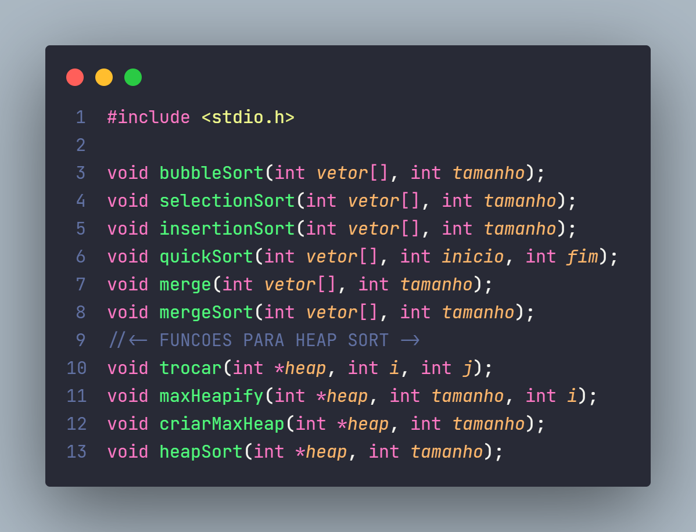
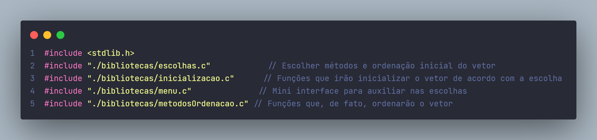
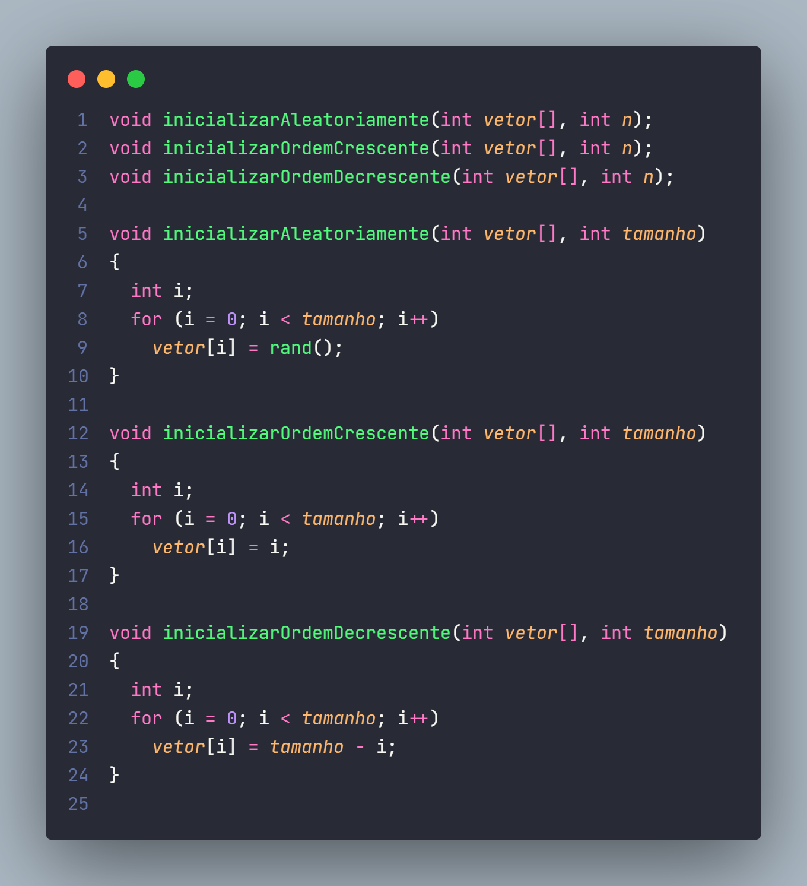
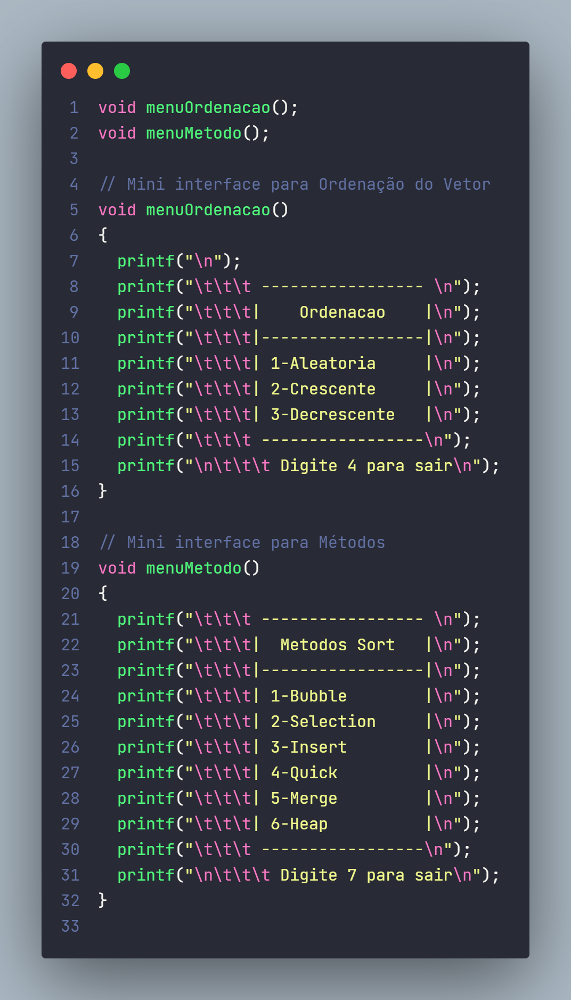
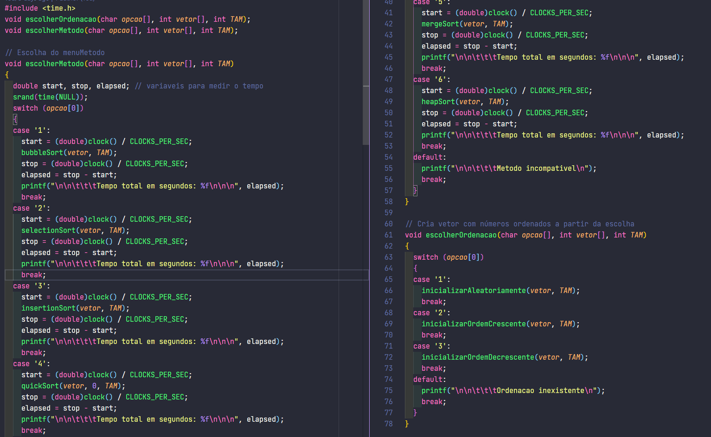

# Ordenações em C - Difereça de tempo (segundos)
Programa calcula o tempo dos principais métodos de ordenações em C.

[](https://github.com/igorlamoia/C-ordenacoes-tempo/blob/main/LICENSE)


## Instruções de Instalação - Windows 10

Realize o download de minGW: https://sourceforge.net/projects/mingw/

Prossiga com a instalação. Após concluída, selecione mingw32-base e mingw32-gcc-g++ para instalar.


Logo após vá em Installation > Apply Changes


Para adicionar gcc como variável de ambiente, vá em Meu Computador > Propriedades.

Depois vá em Configurações avançadas do sistema > Variáveis de Ambiente.

Ache a variável Path e clique em Editar.

Clique em novo e adicione o diretório dos binários que foram instalados com o MinGW (geralmente em C:\MinGW\bin)

Para conferir que a variável foi adicionada, reinicie seu terminal e execute o comando gcc.

Após isso é necessário a instalação do make. Caso possua chocolatey, inicie o `PowerShell` em modo administrador e execute o comando:

```
choco install make
```

Após isso, clone o repositório. Execute, na pasta do projeto, o comando `make` para gerar o arquivo executável e `make run` para executá-lo.

## Objetivo :bookmark_tabs:
 Sabemos que o tempo varia de acordo com a máquina, porém a comparação nos dá uma ideia da eficiência/custo de cada método.
 
 
 ## Métodos
 




## Main (includes) :star:



## Inicialização :clapper:



## Menu :computer:


## Escolha de Método e Ordenação 



